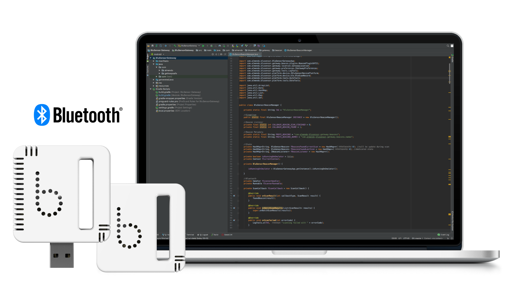
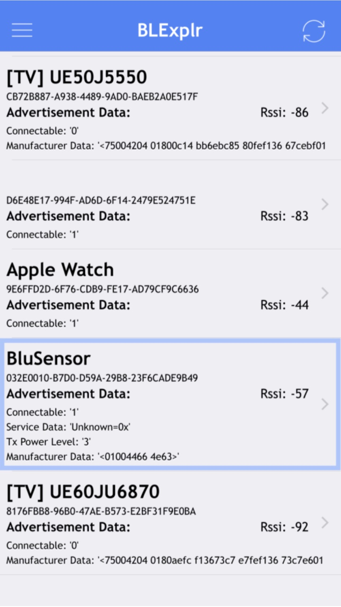

# bluSensor® Bluetooth Low Energy API

## Introduction

You can use any Bluetooth Low Energy API to access sensor data, download logged data, configure alarms, and much more on our bluSensor® devices. 




For more information how to use Bluetooth Low Energy on your platform we refer to the platform’s API documents.

### Bluetooth Low Energy SDKs
* iOS: https://developer.apple.com/bluetooth/
* Android: https://developer.android.com/guide/topics/connectivity/bluetooth-le 
* Xamarin: https://developer.xamarin.com/api/namespace/Android.Bluetooth.LE/ 
* Xamarin: https://developer.xamarin.com/api/namespace/CoreBluetooth/
* Web: https://github.com/WebBluetoothCG/web-bluetooth/blob/gh-pages/implementation-status.md


### Official Bluetooth SIG ID
```
Almendo Technologies GmbH (0x06E8)
```
Please find our official ID here: [Bluetooth - Company ID](https://www.bluetooth.com/specifications/assigned-numbers/company-identifiers/)


# Advertisements

### Service UUIDs

bluSensor® devices are using the following unique service UUIDs
```
a8a82630-10a4-11e3-ab8c-f23c91aec05e
```

### Advertisement Scan Record

All our sensors are broadcasting sensor data using manufacturer specific data.

To filter for bluSensor® devices during discovery you can use the service UUID that is part of the Scan Record. Please note that using scan filters on Android is buggy and it is better to implement your own filter mechanism using the provided UUID from the Scan Record.

#### Service UUID (Scan Record)
```
 a8a82630-10a4-11e3-ab8c-f23c91aec05e
 ```

#### Manufacturer Specific Data (Scan Record)

bluSensor® devices (**1st generation**) (legacy)

sensor type  | alarm code    | sensor data
------------ | ------------- | -------------
1 byte       | 1 byte        | variable bytes


bluSensor® devices (**2nd generation**)

company ID   | company ID    | protocol version | device type  |  device model  | device hw rev | status bits | status code | sensor data |
------------ | ------------- | -----------------| -------------| -------------- | --------------| ------------| ------------|-------------|
0x06         | 0xE8          | 1 byte           | 1 byte       |  1 byte        |   1 byte      |   1 byte    |    1 byte   | 10 bytes     |


#### Company ID
This is our official company identifier assigned by Bluetooth SIG (https://www.bluetooth.com/)

#### Protocol Version
This is the sensor's protocol version (current version=1)

#### Device Types

device type  | description             
------------ | -------------           
01           | Humidity & Temperature  
02           | Motion (Accelerometer)         
03           | Motion 3D Fusion (Euler)       
04           | Air Flow                
05           | Light Ambient
06           | Motion (Accelerometer, Magnetometer, Gyroscope)
07           | Motion (Accelerometer)
08           | Motion Sport
09           | Air Quality Index
10           | Air Quality 
11           | Motion Counter  
12           | Temperature
13           | Temperature (reserved)
14           | Infrared Array Camera  
15           | Particulate Matter 
16           | Proximity Distance 
17           | Light Ambient
18           | Magnetometer
19           | People Detection
20           | People Detection (reserved)
21           | Proximity Counter
22           | Bearing

#### Device Model
 
device model | description            
------------ | ------------- 
09           | bluSensor® AIR WIFI (BLE, Wi-Fi)
10           | bluSensor® AIQ WIFI (BLE, Wi-Fi)


#### Device Hardware Revision
This is the hardware revision number

#### Device Status Bits
These are internal status bits

#### Device Status Codes
These are internal status codes

#### Device Sensor Data
This contains device specific sensor data (depends on device type)

Device Type: Air Quality 

sensor state  | temperature     | humidity      | co2       | tvoc    | aiq index |
------------  | -------------   | ------------- | ---------|---------|-------------|
1 byte        | 2 byte (signed) | 2 byte        | 2 byte   | 2 byte  | 2 byte|


Conversion (Android/Java example)

```c++
//TEMPERATURE (signed, factor 100)
short temperature_signed = (short) ((sensorData[0] & 0xff) | ((sensorData[1] << 8) & 0xff00)); 
float tem = temperature_signed / 100.0;

//HUMIDITY (unsigned, factor 100
float hum = ((int) (sensorData[2] & 0xff) | ((sensorData[3] << 8) & 0xff00)) / 100.0;

//CO2 (unsigned, factor 1)
int co2 = (int) (sensorData[4] & 0xff) | ((sensorData[5] << 8) & 0xff00);

//TVOC (unsigned, factor 1)
int tvoc = (int) (sensorData[6] & 0xff) | ((sensorData[7] << 8) & 0xff00);

//AIQ INDEX (unsigned, factor 1)
int aiq = (int) sensorData[8];

```

# Services

## Device Information Service
```
180a
```

Please find official specification here: [Bluetooth - Device Information Service](https://www.bluetooth.com/specifications/gatt/viewer?attributeXmlFile=org.bluetooth.service.device_information.xml)

## Battery Service
```
180f
```
Please find official specification here: [Bluetooth - Battery Service](https://www.bluetooth.com/specifications/gatt/viewer?attributeXmlFile=org.bluetooth.service.battery_service.xml)

## bluSensor® Service
```
 a8a82630-10a4-11e3-ab8c-f23c91aec05e
```

All bluSensor® devices implement the following characteristics. The logger functionality needs some configurations to be opertional. See details below.

#### Sensor Data
```
a8a82631-10a4-11e3-ab8c-f23c91aec05e
```

* PROPERTIES: read/notify
* LENGTH: 4 bytes
* FORMAT: measurement (see how to convert sensor data section below)
 
#### LED
```
a8a82645-10a4-11e3-ab8c-f23c91aec05e
```
* PROPERTIES: write
* LENGTH: 1 byte 
* FORMAT: 0x01 for blink

#### MAC Address
```
a8a82643-10a4-11e3-ab8c-f23c91aec05e
```
* PROPERTIES: read
* LENGTH: 6 bytes
* FORMAT: Mac Address Bytes XX:XX:XX:XX:XX:XX

#### Logger

The logger of bluSensor needs some configurations to be operational. The configuration steps are.

Enable Logging
1. set time reference from your smartphone
2. configure logger interval
3. enable logging

Download Log
1. listen to notifications on sensor data characteristic on your smartphone
2. start sending log data by using logger control characteristic
3. store ordered measurements on your smartphone (4-byte chunks)

Build Log Timestamps
1. calculate timestamp for each measurement using time reference
2. 1st measurement = time reference
3. 2nd measurement = time reference + logger interval
4. 3rd measurement = time reference + logger interval * 2
5. and so on...

#### Logger Time Reference
```
a8a82636-10a4-11e3-ab8c-f23c91aec05e
```
* PROPERTIES: read/write
* LENGTH: 4 bytes
* FORMAT: any reference timestamp that your app can handle. You need this timestamp later on to calculate the timestamps of each individual measurement.

#### Logger Interval
```
a8a82634-10a4-11e3-ab8c-f23c91aec05e
```
* PROPERTIES: read/write
* LENGTH: 2 bytes
* FORMAT: interval in seconds. It is mandatory to use a logger interval of 5min/10min/15min/30min. You CANNOT use any other interval!

#### Logger On/Off
```
CHARACTERISTIC: a8a82633-10a4-11e3-ab8c-f23c91aec05e
```
* PROPERTIES: read/write
* LENGTH: 1 byte
* FORMAT: 0=OFF 1=ON

#### Logger Control
```
a8a82635-10a4-11e3-ab8c-f23c91aec05e
```
* PROPERTIES: write
* LENGTH: 1 byte
* FORMAT:
  * 1=SEND (sends log via Logger Data Characteristic) 
  * 2=RESET (delete data and stop logger)
  * 3=REBOOT (reboot device and stop logger)

#### Logger Data
```
a8a82637-10a4-11e3-ab8c-f23c91aec05e
```
* PROPERTIES: notify
* LENGTH: 16 bytes
* FORMAT: 4 measurements each 4bytes long are sent (see previous chapter for format)

#### Logger Flash Size
```
a8a82950-10a4-11e3-ab8c-f23c91aec05e
```
* PROPERTIES: read
* LENGTH: 4 bytes
* FORMAT: size of flash memory in bytes

#### Logger Usage
```
a8a82646-10a4-11e3-ab8c-f23c91aec05e
```
* PROPERTIES: read
* LENGTH: 4 bytes
* FORMAT: size of used flash memory in bytes

# Converting Sensor Data

#### Humidity & Temperature (**1st generation**) (legacy)

The sensor data is 4 bytes and can be converted using the following mechanism and formular.

```c++
int hum = (data[2] & 0xff) | ((data[3] << 8) & 0xff00); 
float relHum = -6.0f + 125.0f * (float) hum / (float) 65536;
```


```c++
int temp = (data[0] & 0xff) | ((data[1] << 8) & 0xff00);
float tempC = -46.85f + 175.72f * (float) temp / (float) 65536;
```

Example:
```
0100ac667a63 => 42.5% and 23.5°C
```
#### Humidity & Temperature, CO2, TVOC (**2nd generation**)

```c++
//TEMPERATURE (signed, factor 100)
short temperature_signed = (short) ((sensorData[0] & 0xff) | ((sensorData[1] << 8) & 0xff00)); 
float tem = temperature_signed / 100.0;

//HUMIDITY (unsigned, factor 100
float hum = ((int) (sensorData[2] & 0xff) | ((sensorData[3] << 8) & 0xff00)) / 100.0;

//CO2 (unsigned, factor 1)
int co2 = (int) (sensorData[4] & 0xff) | ((sensorData[5] << 8) & 0xff00);

//TVOC (unsigned, factor 1)
int tvoc = (int) (sensorData[6] & 0xff) | ((sensorData[7] << 8) & 0xff00);

//AIQ INDEX (unsigned, factor 1)
int aiq = (int) sensorData[8];

```


#### SDK Documentation coming soon:
* Accelerometer       
* 3D Fusion (Euler)       
* Air Flow 
* Ambient Light           
* Accelerometer, Magnetometer, Gyroscope 
* Accelerometer (Low Energy)  
* ShakeIt Sports Tracker 
* Air Quality (Industrial)
* Air Quality 
* Usage Counter  
* Temperature Probe (PTC) 
* Temperature Probe (NTC) 
* Infrared Array Camera  
* Particulate Matter 
* Distance 
* Ambient Light  
* Highspeed Magnetometer  
* People Presence Detector  
* People Counter
* Distance Counter


# Development Tools

There are many tools available for iOS and Android that you can use for testing and development.



Here are some of the tools available:
* BLExplr (iOS)
* LightBlue Explorer (iOS and Android)
* nRF Connect (iOS and Android)
* Blue Gecko (iOS and Android)

# Compatible Apps

* [bluSensor® AIR for iOS](https://itunes.apple.com/at/app/blusensor-air/id1018752395?mt=8)
* [bluSensor® AIR for Android](https://play.google.com/store/apps/details?id=com.almendo.blusensor.air)
* [bluSensor® GATEWAY for Android](https://play.google.com/store/apps/details?id=com.almendo.blusensor.gateway)

# Purchase Sensors

You can buy sensors and development kits in our online shop at https://www.blusensor.com/shop/

# Support

Having trouble with bluSensor® API or need development support? 

You will get direct support from our **core development team** (free of charge)!

You can contact us anytime at support@blusensor.com

You need a sensor type that is not listed yet?

Just drop us an email!

# Troubleshooting

Unfortunately, Android's BLE API is much less convenient than its iOS counterpart. Here is a short summary what you need to consider:

* BLE GATTs commands need to be **queued**. Android does not support calling multiple GATT commands at a time.
  * [Click here for a sample implementation](https://github.com/NordicPlayground/puck-central-android/blob/master/PuckCentral/app/src/main/java/no/nordicsemi/puckcentral/bluetooth/gatt/GattManager.java)
* A really good blog for Android and BLE can be found here:
  * [Lessons for First-Time Android Bluetooth LE developers](https://android.jlelse.eu/lessons-for-first-time-android-bluetooth-le-developers-i-learned-the-hard-way-fee07646624?gi=bcb339ded9b2) 


